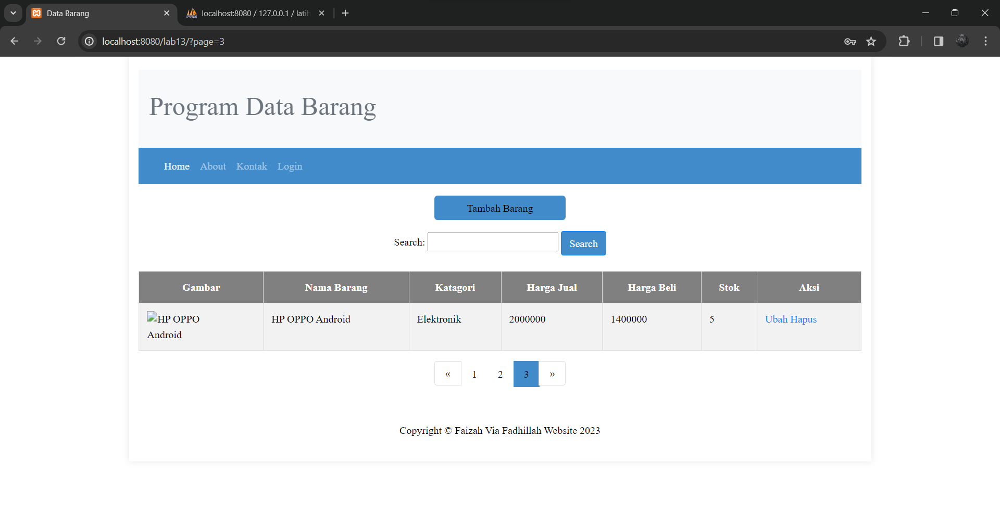

`Nama  : Faizah Via Fadhillah`

`Nim   : 312210460`

`Kelas : TI22.A4`

# Praktikum 13 Pagination

    Pagination digunakan untuk membatasi atau membagi record data yang akan ditampilkan pada
    laman web. Dari seluruh record data yang ada akan dibagi berdasarkan jumlah record
    per-halaman.
    Pada prinsipnya untuk membatasi tampilan record data pada query mysql menggunakan LIMIT
    dan OFFSET;

* Query alwal:

```sql
$sql = “SELECT * FROM tabel_barang”;
```
 

* Untuk menapilkan data dari record ke 1 sampai record ke 10:

```sql
$sql = “SELECT * FROM table_barang LIMIT 10”;
```


* Untuk menampilkan data dari receord ke 11 sampai dengan record ke 20, disini digunakan
OFFSET:

```sql
$sql = “SELECT * FROM table_barang LIMIT 10,20”;

```


* Untuk mengetahui jumlah record secara keseluruhan:

```sql
$sql = “SELECT COUNT(*) FROM table_barang”;

```


* Misal resultnya adalah 30 record, akan ditampilkan perhalaman sejumlah 10 record, maka:

```sql
$page = $row_count / $per_page; ==> 3 = 30/10
```

# Hasil

